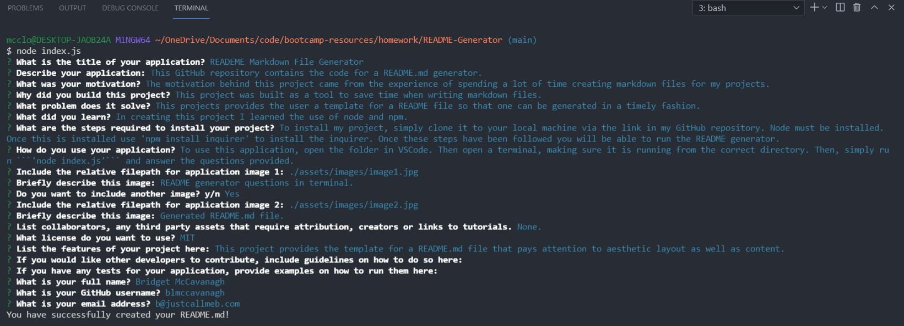
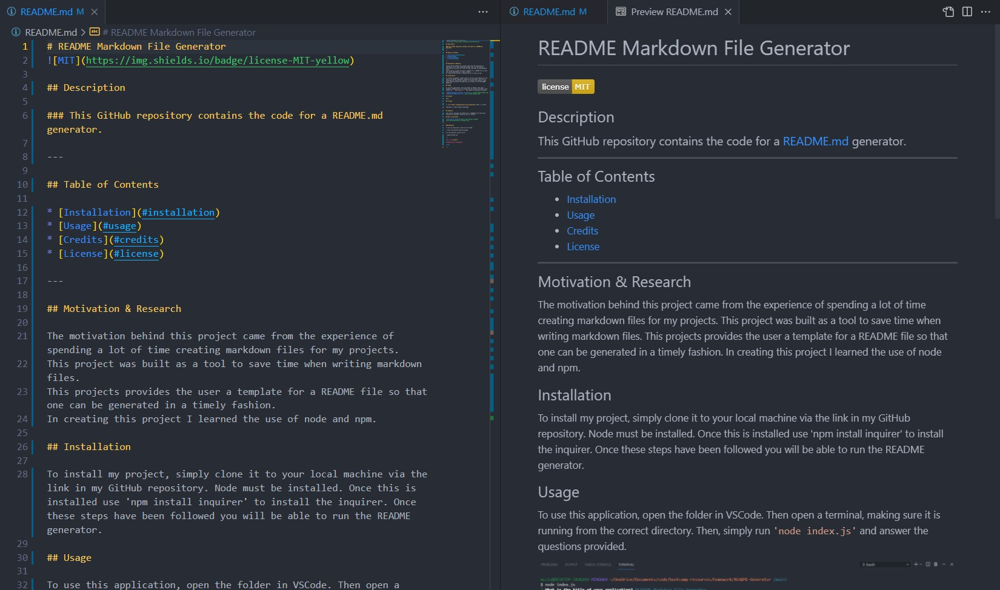

# README Generator

## This Github repository contains the code for a README.md generator.

## The generator allows a user to quickly create a professional README.md file that follows establised GitHub's best practices and standards.

---

## Table of Contents

* [Motivation and Research](#motivation-and-research)
* [Development](#development)
  * [Web development technologies](#web-development-technologies)
  * [Graphic design and branding](#graphic-design-and-branding)
  * [Challenges](#challenges)
* [Repository Link:](#repository-link:)
* [Generated README Example:](#generated-README-example)
* [Application Screenshots:](#application-screenshots:)

---

## Motivation and Research

The motivation behind this project came from the experience of spending a lot of time creating markdown files for my projects. This project provides the user a template for a README file so that one can be generated in a timely fashion while following established README conventions and standards.

## Development

### Web development technologies

Development of the project was centered around Node.js, an open-source, cross-platform, back-end JavaScript runtime environment that runs on the V8 engine and executes JavaScript code outside a web browser and npm, a package manager for the JavaScript programming language.
 
Links to the languges and tools used to build this project are included below:

* Markdown
* Javascript ES6
* Node.js
    * https://nodejs.org/
* npm
    * https://www.npmjs.com/
* npm Inquirer
    * https://www.npmjs.com/package/inquirer

### Graphic design and branding

Working from a template for a best practice README.md file, using Node.js I developed the needed JavaScript to prompt the user for information to populate the file with the required text. Following established conventions and layout, I ensured the resulting README.md has the ability to display all the relevant information, images and links as well as contact details.

As this project provides a template for other users to create their own README file, the addition of personal branding is unnecessary.

### Challenges

The development of this application required the use of Node.js and npm, including the installation of the Inquirer.js package. These were new technologies for me as a web developer and required testing and research to understand these tools in order to implement them to create a working project for other users.

---

**Thank you for visiting.**

---

### Repository Link:

* https://github.com/blmccavanagh/README-Generator

---

### Generated README Example:

View the generated <a href="generatedREADME.md">README</a> file here.

---

### Application Screenshots:

*Template questions run in the terminal* 

---

*Generated README.md file*

---

*README Generator walkthrough video*

<a href="https://drive.google.com/file/d/11aFurmS1GbDaJPlSg9OdnQ-NyPjMWemB/view?usp=sharing">Click here to watch the video!</a>

---