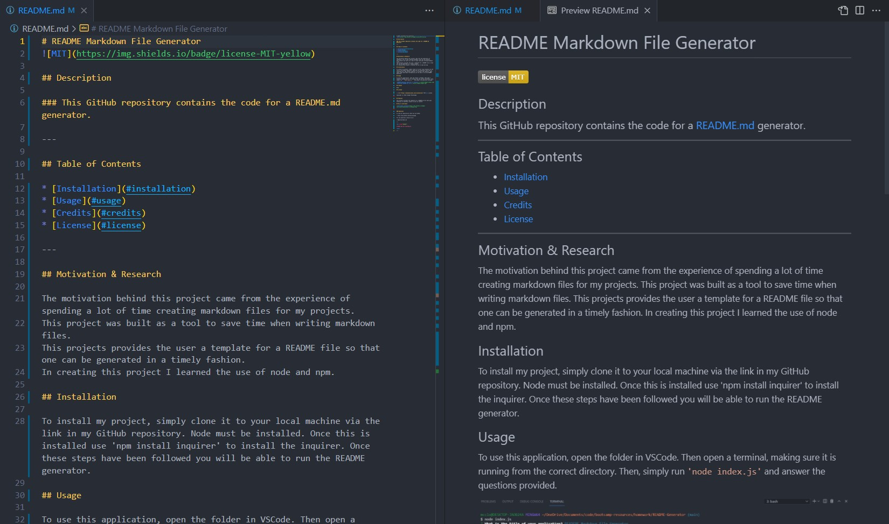

# README Generator


## Description

### This Github repository contains the code for a README.md generator.

---

## Table of Contents

* [Installation](#installation)
* [Usage](#usage)
* [Credits](#credits)
* [License](#license)

---

## Motivation & Research

The motivation behind this project came from the experience of spending a lot of time creating markdown files for my projects.
This project was built as a tool to save time when writing markdown files.
This project provides the user a template for a README file so that one can be generated in a timely fashion.
In creating this project I learned the use of node and npm.

## Installation

To install my project, simply clone it to your local machine via the link in my GitHub repository. Node must be installed. Once this is installed use ```npm install inquirer``` to install the inquirer. Once these steps have been followed you will be able to run the README generator.

## Usage

To use this application, open the folder in VSCode. Then open a terminal, aking sure it is running from the correct directory. Then, simply run ```node index.js``` and answer the questions provided.




## Credits

None.

## License


<a href="https://choosealicense.com/licenses/mit/">MIT</a> License

Copyright (c) 2021 Bridget McCavanagh


## Features

This project provides the template for a README.md file that pays attention to aesthetic layout as well as content.

## How to Contribute


### Questions

To view my repositories check out my GitHub:

* http://www.github.com/blmccavanagh

For any questions contact me at:

* b@justcallmeb.com

---

<div align="center">

**Thank you for visiting.**

</div>

---
